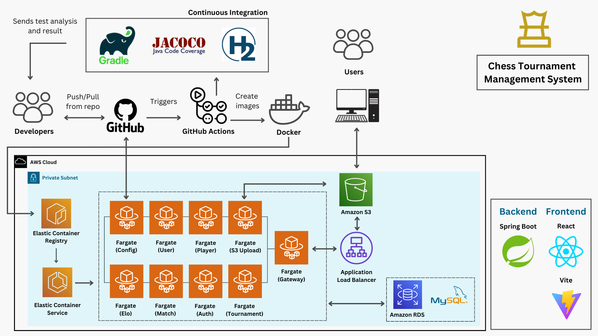

# Chess Tournament Management System

## Overview
This project is designed to manage chess tournaments using a microservice architecture deployed on AWS. It comprises multiple Spring Boot backend services and a React-based frontend.

## Project Structure
### Microservices
- **config-server**: Centralized configuration service.
- **gateway**: API gateway for routing client requests.
- **auth-service**: Manages authentication and authorization.
- **user-service**: Handles user management.
- **match-service**: Processes match data.
- **player-service**: Maintains player information.
- **s3-upload-service**: Facilitates file uploads to S3.
- **elo-service**: Calculates player ratings using the Elo system.
- **tournament-service**: Manages tournament data.

## Basic Features
- **User Management**: Simple user registration and authentication system.
- **Tournament Management**: Basic CRUD operations for creating, updating, and managing tournaments.
- **Leaderboard**: View player rankings.
- **Profile Page**: Profile pages with player details, statistics and match history.
- **Player Statistics**: Insights on player performance and elo history.
- **Match Management**: Auto generation of matches between players.
- **Tournament Recommendations**: Suggested tournaments based on player Elo ratings and availability.
- **RESTful APIs**: Standardized endpoints to ensure consistent communication between microservices.
- **Database Integration**: Utilizes MySQL for persistent data storage and effective data retrieval.
- **Configuration Management**: Centralized configuration managed through Spring Config Server to streamline property distribution.
- **Error Handling**: Comprehensive logging and error capture across all microservices to identify and address issues effectively.
  
## Advanced Features
- **Microservice Architecture**: Designed for scalability and independent development of service modules.
- **AWS Integration**:
  - **ECS (Fargate)**: Manages container orchestration and scaling.
  - **RDS (MySQL)**: Provides a managed relational database backend.
  - **S3**: Used for hosting and serving frontend assets.
  - **ECR (Elastic Container Registry)**: Secure storage for Docker container images.
  - **Service Discovery**: Employs AWS Cloud Map for efficient service lookup within a private VPC.
  - **Load Balancing**: Uses AWS Application Load Balancer (ALB) for distributing incoming traffic across services.
  - **Monitoring**: Integrated Amazon CloudWatch for logs and metrics.
- **Security**: Robust JWT-based authentication and authorization mechanisms. Access control based on user roles.
- **Algorithms**: Implements advanced Elo calculation for competitive ranking and matchmaking with Swiss and Knockout formats.
- **CICD Pipeline**: Fully automated deployment pipeline using Gradle, Docker, GitHub Workflows, and AWS services.

## Architecture Diagram

## Team Members
- [Philip](https://github.com/philipljh)  
- [Vicki](https://github.com/Milikciv)  
- [Xavier](https://github.com/teystyxavy)
- [Qian Yun](https://github.com/q1anyun)
- [Jia Kai](https://github.com/jiakai-2002)

## Configuration table
  
   | Components  | Technology  | 
   | :---        |    :----:   |   
   | Frontend  | React 18+, Vite, BootStrap, MUI (Material-UI) | 
   | Backend   | Spring Boot 3.3, Java 21 |
   | Security |  Spring Security, JWT|
   | Database | JPA-Hibernate, MySQL|
   | API Documentation	| Swagger API|
   | Client Build | npm|
   | Server Build| Gradle|
   | API testing| POSTMAN|
   | Tool | VSC|
