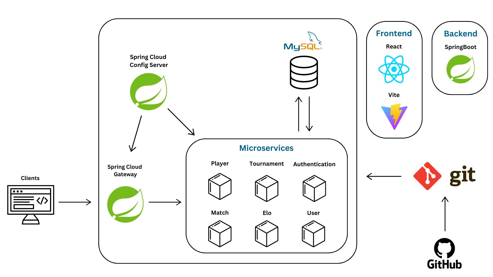

# Chess Tournament System

## Project Description 
CS203 Project - Chess Tournament System built with SpringBoot and React.
This project is currently working in progress.

## Team Members
- [Philip](https://github.com/philipljh)  
- [Vicki](https://github.com/Milikciv)  
- [Xavier](https://github.com/teystyxavy)
- [Qian Yun](https://github.com/q1anyun)
- [Jia Kai](https://github.com/jiakai-2002)

## Configuration table
  
   | Components  | Technology  | 
   | :---        |    :----:   |   
   | Frontend  | React 18+, Vite, BootStrap, MUI (Material-UI) | 
   | Backend   | Spring Boot 3.3, Java 21 |
   | Security |  Spring Security, JWT|
   | Database | JPA-Hibernate, MySQL|
   | API Documentation	| Swagger API|
   | Client Build | npm|
   | Server Build| Gradle|
   | API testing| POSTMAN|
   | Tool | VSC|